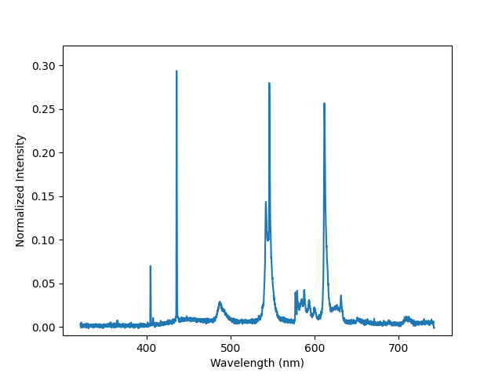

# Thorlabs CCS Spectrometer

The Thorlabs CCS spectrometers use a Cypress EZ-USB chip under the hood.
By default the chip only has a very minimal bootloader. Every time the 
device is plugged-in, you need to upload a firmware to RAM to make it work 
(which turns on a green 'READY' LED on the device). Once the firmware 
is uploaded, the device is re-enumerated under a different PID (0x8081),
and ready to exchange data through the TLCCS library.

This repository is a crude linux-compatible re-implementation in python of the LGPLv2.1 
TLCCS library provided by thorlabs, using pyUSB.

## Installation

```bash
conda env create -f ccs100.yml
```

or 

```
pip install pyusb libusb-package
```

### Windows

Install Thorlabs' ThorSpectra software: https://www.thorlabs.com/software_pages/viewsoftwarepage.cfm?code=CCS

This will take care of uploading the firmware automatically when the device is plugged in.

### Linux

#### Add udev rules

Make sure user is part of the plugdev group:

```bash
sudo usermod -aG plugdev $USER
```

Then add the proper udev rules. For the CCS100:

```bash
sudo tee /etc/udev/rules.d/99-thorlabs.rules > /dev/null << 'EOF'
SUBSYSTEMS=="usb", ATTRS{idVendor}=="1313", ATTRS{idProduct}=="8080", GROUP="plugdev", MODE="0666"
SUBSYSTEMS=="usb", ATTRS{idVendor}=="1313", ATTRS{idProduct}=="8081", GROUP="plugdev", MODE="0666"
EOF
```

Alternatively you can set permissions to all Thorlabs devices:

```bash
sudo tee /etc/udev/rules.d/99-thorlabs.rules > /dev/null << 'EOF'
SUBSYSTEMS=="usb", ATTRS{idVendor}=="1313", GROUP="plugdev", MODE="0666"
EOF
```

Reload udev rules:

```bash
sudo udevadm control --reload-rules
sudo udevadm trigger
```

#### Firmware file

You need a firmware file (e.g. CCS100.spt) provided by Thorlabs to operate the device. 
They can be obtained from Thorlabs by installing the ThorSpectra software on a windows machine.
https://www.thorlabs.com/software_pages/viewsoftwarepage.cfm?code=CCS

The files are usually located here:
```bash
C:/Program Files/Thorlabs/CCS/inf/Loader/CCS*.spt
```

Alternatively, they can be extracted from an older version of Thorlabs OSA software
with innoextract:

```bash
sudo apt install innoextract
curl -O https://www.thorlabs.com/software/THO/OSA/V2_90/ThorlabsOSASW_Full_setup.exe
mkdir ccs_firmware
mkdir temp_extract
innoextract --extract --output-dir=temp_extract \
--include "app/CCS/inf/Loader/CCS100.spt" \
--include "app/CCS/inf/Loader/CCS125.spt" \
--include "app/CCS/inf/Loader/CCS150.spt" \
--include "app/CCS/inf/Loader/CCS175.spt" \
--include "app/CCS/inf/Loader/CCS200.spt" \
ThorlabsOSASW_Full_setup.exe
mv temp_extract/app/CCS/inf/Loader/CCS*.spt ccs_firmware/
rm -rf temp_extract
rm ThorlabsOSASW_Full_setup.exe
```

## Usage

```
conda activate ccs100
```

Get single scan:

```python
from tlccs import TLCCS

ccs100 = TLCCS(
    firmware_file = 'CCS100.spt',
    PID_loader = 0x8080,
    PID_spectro = 0x8081
)

ccs100.set_integration_time(0.1)
ccs100.start_single_scan()
spectrum = ccs100.get_scan_data()
```

Continuous acquisition:

```python
import matplotlib.pyplot as plt

ccs100 = TLCCS(
    firmware_file = 'CCS100.spt',
    PID_loader = 0x8080,
    PID_spectro = 0x8081
)

ccs100.set_integration_time(0.1)

fig, ax = plt.subplots()
line, = ax.plot(ccs100.data.factory_cal.wl, array.array('f', [0]*TLCCS_NUM_PIXELS))
ax.set_xlabel("Wavelength (nm)")
ax.set_ylabel("Normalized Intensity")
ax.set_ylim(-0.01, 1.1)
plt.ion()
plt.show()

ccs100.start_continuous_scan()

try:
    while True:
        
        spectrum = ccs100.get_scan_data()
        line.set_ydata(spectrum)
        ax.set_ylim(-0.01, 1.1*max(spectrum))
        fig.canvas.draw()
        fig.canvas.flush_events()

except KeyboardInterrupt:
    print("Stopping acquisition...")
    ccs100.reset()  
    plt.ioff()
    plt.close(fig)
```



## USB protocol

### Cypress EZ-USB

EZ-USB Technical Reference Manual: https://www.infineon.com/assets/row/public/documents/24/57/infineon-ez-usb-technical-reference-manual-additionaltechnicalinformation-en.pdf?fileId=8ac78c8c7d0d8da4017d0f9093657d61

After initial enumeration, that host driver holds the CPU in
reset, downloads the firmware and USB descriptor data into
the EZ-USB’s RAM, then releases the CPU reset. The EZ-
USB then ReNumerates as a custom device.

We have an EEPROM with 0xC0 byte first, indicating
only custom VID (0x1313) and PID (0x8080) before renumeration.
This is recognized by thorlabs driver to start uploading
the firmware.

CPU hold:
```
    bmRequestType: 0x40
    bRequest: 160 (0xA0)
    wValue: 0xe600
    wIndex: 0 (0x0000)
    wLength: 1
    Data Fragment: 01
```

CPU release:
```
    bmRequestType: 0x40
    bRequest: 160 (0xA0)
    wValue: 0xe600
    wIndex: 0 (0x0000)
    wLength: 1
    Data Fragment: 00
```

Prior to ReNumeration, the host downloads data into the EZ-
USB’s internal RAM. The host can access two on-chip EZ-
USB RAM spaces — Program / Data RAM at 0x0000-
0x3FFF and Data RAM at 0xE000-0xE1FF — which it can
download or upload only when the CPU is held in reset.

bmRequestType 0xC0 can be used to read from on-board RAM and 0x40 to write.

|Endpoint|Direction|Transfer Type     |bmRequestType|bRequest   |Interpretation     |
|--------|---------|------------------|-------------|-----------|-------------------|
|0x00    |OUT      |CONTROL (0x02)    |0x40         |0xA0 (160) |write firmware     |
|0x00    |IN       |CONTROL (0x02)    |0xC0         |0xA0 (160) |read firmware      |

The firmware seems to be uploaded in two stages, between which the CPU is briefly released, maybe to setup some registers?
What probably happens is that the stage 1 firmware sets the 
USBCS register so that renumeration is not triggered at that stage.

### Thorlabs CCS100

|Endpoint|Direction|Transfer Type     |bmRequestType|bRequest   |Interpretation       |
|--------|---------|------------------|-------------|-----------|---------------------|
|0x00    |OUT      |CONTROL (0x02)    |0x40         |0x23 (35)  |Set integration time | 
|0x00    |OUT      |CONTROL (0x02)    |0x40         |0x24 (36)  |Start Scan           | 
|0x00    |OUT      |CONTROL (0x02)    |0x40         |0x26 (38)  |Reset                | 
|0x80    |IN       |CONTROL (0x02)    |0xC0         |0x21 (33)  |Read EEPROM          | 
|0x80    |IN       |CONTROL (0x02)    |0xC0         |0x30 (48)  |Get status           |
|0x86    |IN       |BULK (0x03)       |             |           |Spectrogram          |

## Windows driver hierarchy

tlccsloader64.sys is the driver that loads ccs100.spt which likely contains
data and firmware, onto the device. I surmise that tlccsloader64.sys is nothing but a renamed CyUsb.sys
 
Then the SPLICCO device driver (TLSPLICCODEVS_VIW7.inf) takes on, and marks the renumerated device as a RAW USB VISA instrument, using WinUSB.sys

The TLCCS library is the last layer that actually talks to the RAW device with
NI-VISA to interact with the spectrophotometer

On windows, with the drivers installed, the firmware is automatically sent to the 
device when it is plugged in. Here, we use pyusb to load the firmware and interact with the device directly.
